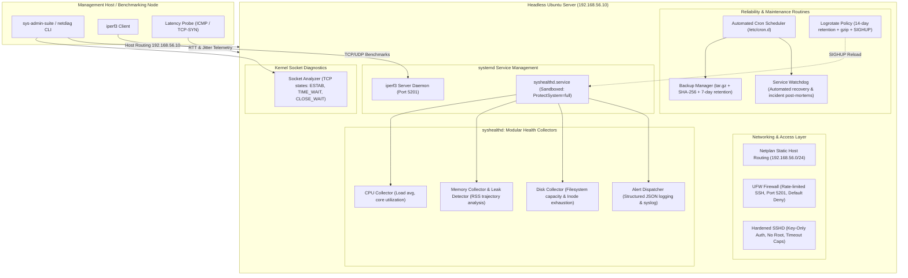

# Linux Server Administration & Network Diagnostic Suite

[](https://github.com/byteofyash/linux-server-diagnostic-suite/actions)
[](#)
[](#)
[](#)
[](#)
[](#)
[](LICENSE)

An enterprise-ready Linux systems administration, daemon engineering, and network diagnostic framework designed for headless Ubuntu Server environments. Built with a modular Python/Bash architecture, hardened `systemd` service units, automated cron disaster recovery routines, and an `iperf3` network benchmarking & TCP socket diagnostic suite.

---

## 🏗 Architecture Overview



---

## ⚡ Key Highlights

### 1. Headless Server Virtual Environment & Hardening
- **Virtualization Support**: Complete `Vagrantfile` provisioning a headless Ubuntu 22.04 LTS environment with static host-only networking (`192.168.56.10`), plus a dual-node `docker-compose` cluster for rapid containerized testing.
- **Static Host Routing**: Automated Netplan configuration (`60-static-diagnostics.yaml`) binding static management interfaces and kernel routing tables.
- **UFW Firewall Automation**: Enforces a strict default-deny incoming policy, rate-limits SSH to mitigate brute-force attempts, and scopes benchmarking ports (5201 TCP/UDP) to trusted management subnets.
- **SSH Key-Based Hardening**: Disables password authentication, disables root login (`PermitRootLogin no`), enforces public key cryptography, and verifies syntax via `sshd -t` prior to service reload.

### 2. Modular Health Daemon (`syshealthd`)
- **systemd Integration**: Deployed as a hardened `systemd` service (`syshealthd.service`) utilizing Linux security sandboxing (`ProtectSystem=full`, `ProtectHome=read-only`, `PrivateTmp=true`, `NoNewPrivileges=true`).
- **Dynamic Signal Handling**: Supports hot configuration reloads via `SIGHUP` without dropping active state or PID references, and graceful shutdown on `SIGTERM`/`SIGINT`.
- **Sliding-Window Memory Leak Detection**: Rather than relying solely on raw memory thresholds, `MemoryLeakDetector` tracks process Resident Set Size (RSS) trajectories across a temporal sliding window, flagging processes exhibiting sustained monotonic growth ($\ge 15\text{ MB}$ over consecutive intervals).
- **Core Telemetry**: Real-time normalized per-core load averages (1m, 5m, 15m), disk partition capacity, and inode exhaustion alarms.

### 3. Reliability, Disaster Recovery & Automation
- **Automated Backup Manager (`backup_manager.sh`)**: Creates timestamped compressed tarballs (`.tar.gz`), generates and validates cryptographic SHA-256 signatures, performs tarball integrity validation, and enforces automated retention pruning (7-day default).
- **Automated Process Recovery Watchdog (`service_watchdog.sh`)**: Probes critical server units (`syshealthd`, `ssh`, `ufw`), identifies crashed or hung states, initiates automatic restart remediation via `systemctl`, and logs JSON incident post-mortems to `/var/log/syswatchdog_incidents.log`.
- **Logrotate Routine**: Daily log rotation with 14-day retention, gzip compression, delayed compression, and `postrotate` signaling.
- **Cron Scheduling**: Pre-configured cron definitions in `/etc/cron.d/sys-maintenance`.

### 4. Network Diagnostics & Benchmarking Suite (`netdiag`)
- **Throughput & Bandwidth**: Wraps `iperf3` to measure TCP throughput, parallel stream efficiency, and TCP retransmissions.
- **Jitter & Packet Loss**: Executes UDP saturation tests measuring jitter ($ms$), lost datagrams, and percentage packet loss.
- **Hybrid Latency Probing**: Measures ICMP ping round-trip times (min, avg, max, mdev), with automatic fallback to TCP-SYN latency probing if raw ICMP is dropped or sandboxed.
- **TCP Socket State Analyzer**: Parses kernel socket tables (`ss` / `netstat`), breaking down connection states (`ESTABLISHED`, `LISTEN`, `TIME_WAIT`, `CLOSE_WAIT`, `SYN_SENT`), detecting application **socket leaks** (lingering `CLOSE_WAIT`), and flagging transmit/receive buffer backpressure.
- **Report Generation**: Renders terminal ASCII summary tables and exports structured Markdown / JSON audit reports.

---

## 🚀 Quickstart & Installation

### Option A: Local Installation (Linux Server / VPS)
```bash
# Clone the repository
git clone https://github.com/byteofyash/linux-server-diagnostic-suite.git
cd linux-server-diagnostic-suite

# Install binaries, systemd service, logrotate, and cron tasks
sudo ./install.sh --enable-daemon

# Verify system health overview
sys-admin-suite status
```

### Option B: Spin up Virtualized Headless Server (Vagrant)
```bash
cd provisioning
vagrant up
vagrant ssh
```

### Option C: Instant Multi-Node Docker Sandbox
```bash
docker compose -f provisioning/docker-compose.yml up -d
docker exec -it client-benchmarker /opt/linux-server-diagnostic-suite/bin/sys-admin-suite netdiag --target 192.168.56.10
```

---

## 💻 CLI Usage Guide

The unified `sys-admin-suite` command provides a single entry point for all diagnostics and administration:

```
========================================================================
     __   _                  ___       __          _        _____       _ _       
    / /  (_)__  __ _____ __ / _ | ____/ /_ _  ____(_)__    / __/_ _____(_) /____  
   / /__/ / _ \/ // /\ \ // __ |/ _  /  ' \/ // / / _ \  _\ \/ // / __/ / __/ -_) 
  /____/_/_//_/\_,_//_\_\/_/ |_|\_,_/_/_/_/\_,_/_/_//_/ /___/\_,_/\__/_/\__/\__/  
                     Server Administration & Diagnostic Suite                       
========================================================================
```

### 1. System Health Audit (`status`)
```bash
sys-admin-suite status
```
```text
System Health Status: OK
CPU: 18.4% (Cores: 8, 1m Load: 1.12)
RAM: 42.1% (3450.0 MB / 8192.0 MB)
Swap: 0.0%
Disk Partitions Inspected: 1
  - /: 48.5% used (118.2 GB avail), Inodes: 12.4%
Memory Leak Watchdog: No anomalous monotonic RSS expansion detected.
```

### 2. Network Benchmarking & Socket Diagnostics (`netdiag`)
```bash
# Full diagnostic audit against server node
sys-admin-suite netdiag --target 192.168.56.10 --all --export /tmp/audit.md
```

#### Sample Terminal Output:
```text
========================================================================
       LINUX SERVER NETWORK DIAGNOSTIC & BENCHMARK REPORT               
========================================================================

[1] Latency & Packet Loss Profile (Target: 192.168.56.10)
+----------------------+---------+------+
| Metric               | Value   | Unit |
+----------------------+---------+------+
| Status               | OK      | -    |
| Packets Transmitted  | 5       | pkts |
| Packets Received     | 5       | pkts |
| Packet Loss          | 0.0%    | %    |
| Min Round-Trip Time  | 0.241   | ms   |
| Avg Round-Trip Time  | 0.312   | ms   |
| Max Round-Trip Time  | 0.405   | ms   |
| Jitter (mdev/stddev) | 0.058   | ms   |
+----------------------+---------+------+

[2] iperf3 TCP Throughput Benchmark
+---------------------+---------+-----------+
| Metric              | Value   | Unit      |
+---------------------+---------+-----------+
| Sender Bitrate      | 942.30  | Mbits/sec |
| Receiver Bitrate    | 939.85  | Mbits/sec |
| Total Transferred   | 562.40  | MBytes    |
| TCP Retransmissions | 0       | retrans   |
| Parallel Streams    | 2       | streams   |
+---------------------+---------+-----------+

[3] iperf3 UDP Jitter & Packet Loss Benchmark
+-----------------+-------+-----------+
| Metric          | Value | Unit      |
+-----------------+-------+-----------+
| Bandwidth Rate  | 50.0  | Mbits/sec |
| Jitter          | 0.042 | ms        |
| Lost Packets    | 0     | pkts      |
| Total Packets   | 3550  | pkts      |
| UDP Packet Loss | 0.0%  | %         |
+-----------------+-------+-----------+

[4] Kernel Socket State & Leak Diagnostics
+-------------+-------+-------------------------------------------------+
| TCP State   | Count | Health Implication                              |
+-------------+-------+-------------------------------------------------+
| ESTABLISHED | 34    | Active connections communicating data           |
| LISTEN      | 12    | Daemon ports awaiting incoming handshakes       |
| TIME_WAIT   | 8     | Closed locally; awaiting socket timeout release |
| CLOSE_WAIT  | 0     | Remote closed; application awaiting close()     |
+-------------+-------+-------------------------------------------------+

✓ Socket tables healthy: No connection leaks or buffer backpressure detected.
========================================================================
```

### 3. Sockets & Connection Leaks Inspection (`sockets`)
```bash
sys-admin-suite sockets
```

### 4. Automated Backup Operations (`backup`)
```bash
# Create verified backup
sys-admin-suite backup backup

# Verify all backup signatures
sys-admin-suite backup verify

# List backup archives
sys-admin-suite backup list
```

### 5. Service Watchdog & Auto-Recovery (`watchdog`)
```bash
sys-admin-suite watchdog
```

---

## 📂 Repository Structure

```text
.
├── .github/
│   └── workflows/
│       └── ci.yml                     # GitHub Actions multi-version CI pipeline
├── bin/
│   └── sys-admin-suite               # Unified CLI orchestrator executable
├── daemon/
│   ├── collectors/
│   │   ├── cpu.py                    # CPU load & core utilization collector
│   │   ├── memory.py                 # RAM, Swap & RSS Memory Leak Detector
│   │   └── disk.py                   # Disk partition capacity & inode collector
│   ├── systemd/
│   │   └── syshealthd.service        # Sandboxed systemd service unit
│   ├── alerts.py                     # Structured JSON event & alert dispatcher
│   ├── config.json                   # Polling intervals & alert thresholds
│   └── syshealthd.py                 # Core background monitoring daemon
├── diagnostics/
│   ├── benchmarks/
│   │   └── iperf_runner.py           # iperf3 automation & JSON parser
│   ├── latency/
│   │   └── probe.py                  # Latency, jitter & TCP-SYN fallback probe
│   ├── sockets/
│   │   └── socket_analyzer.py        # TCP socket state parser & leak analyzer
│   ├── netdiag.py                    # Network diagnostic CLI entry point
│   └── reporter.py                   # ASCII table & Markdown audit reporter
├── provisioning/
│   ├── scripts/
│   │   ├── harden_ssh.sh             # Key-only SSH hardening automation
│   │   ├── setup_network.sh          # Netplan & static routing configuration
│   │   └── setup_ufw.sh              # UFW firewall rules & rate-limiting
│   ├── Dockerfile                    # Ubuntu 22.04 LTS container testbed
│   ├── docker-compose.yml            # Multi-node server/client simulation
│   └── Vagrantfile                   # Headless Ubuntu 22.04 LTS VM definition
├── reliability/
│   ├── cron/
│   │   └── sys-maintenance.cron      # Automated maintenance cron schedule
│   ├── logrotate/
│   │   └── syshealthd.logrotate      # Log rotation & compression policy
│   ├── backup_manager.sh             # Backups with SHA-256 & retention pruning
│   └── service_watchdog.sh           # Auto-recovery watchdog & incident logger
├── tests/
│   ├── test_collectors.py            # Unit tests for CPU/Mem/Leak/Disk
│   ├── test_iperf_runner.py          # Unit tests for iperf3 parsing
│   ├── test_latency_probe.py         # Unit tests for latency probing
│   ├── test_sockets.py               # Unit tests for socket leak detection
│   └── test_shell_scripts.sh         # Integration tests for shell scripts
├── install.sh                        # Automated system installer
├── uninstall.sh                      # Clean uninstallation script
├── requirements.txt                  # Python environment dependencies
├── LICENSE                           # MIT License
└── README.md                         # Project documentation
```

---

## 🧪 Verification & Testing

Run the automated test matrix:
```bash
# Run all Python unit tests (Collectors, Leaks, Sockets, Benchmarks)
python3 -m unittest discover -s tests -v

# Run ShellCheck and Shell script integration test suite
bash tests/test_shell_scripts.sh
```

---

## 📜 License

This project is licensed under the MIT License - see the [LICENSE](LICENSE) file for details.
